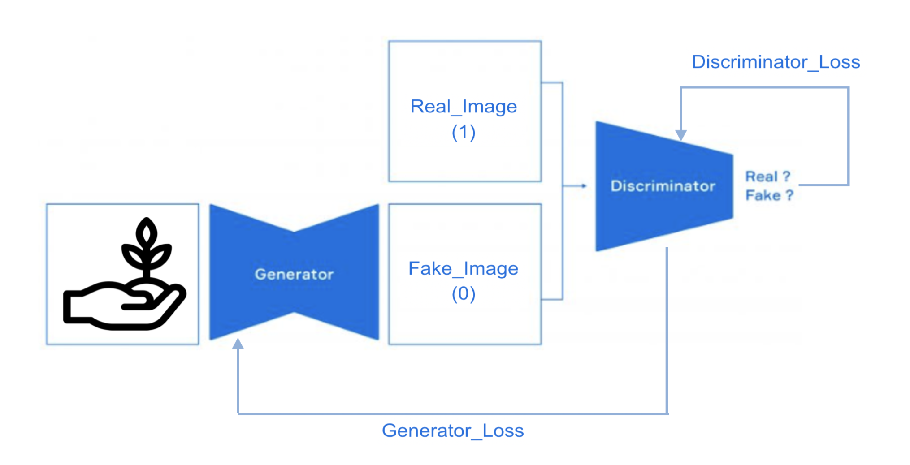
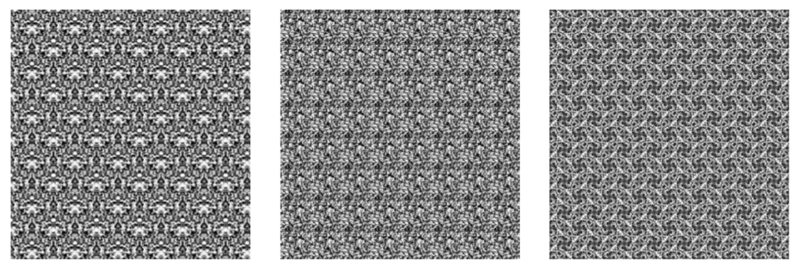
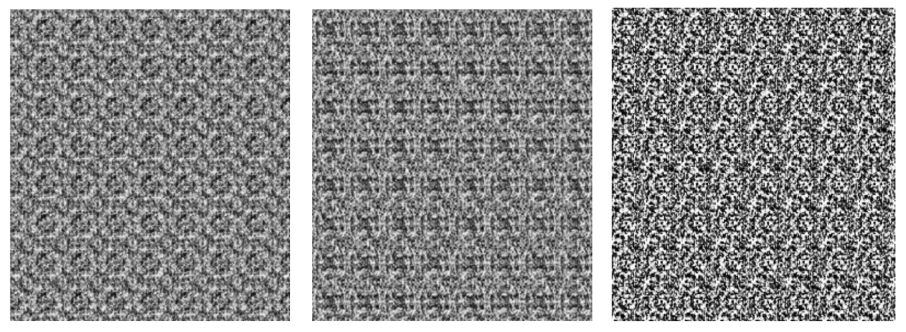

# The Wall paper Project

In this project, I implemented a Generative Adversarial Network and trained this network with the Wallpaper image data set.  While training the Wallpaper dataset, The GAN (Generative Adversarial Network) learns the recurring pattern features of Wallpaper images and generates synthesized patterns. 

Since reproducing a visual realism is a major issue in the area of computer graphics, textures are commonly used when rendering synthetic images. The goal of this project is to generate a artificial Wallpaper pattern images, which have consistent features of original real pattern images, by training a Generative Adversarial Network with Wallpaper data set

## Original Wallpaper Image

## Fake Wallpaper Image 



