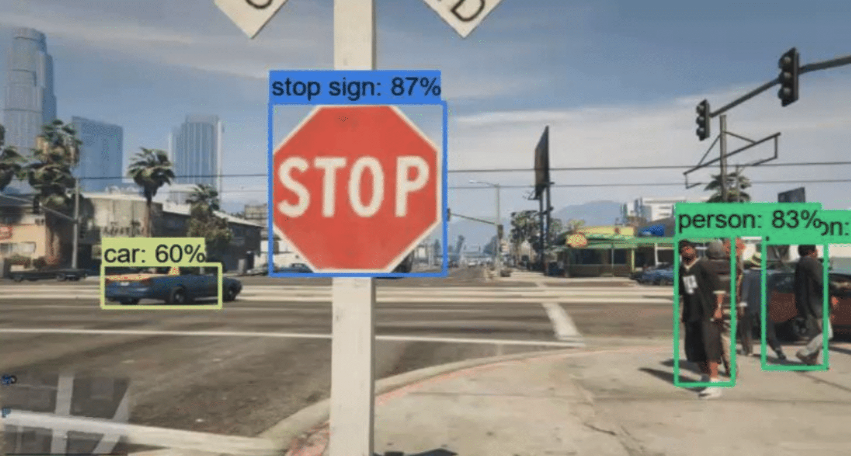
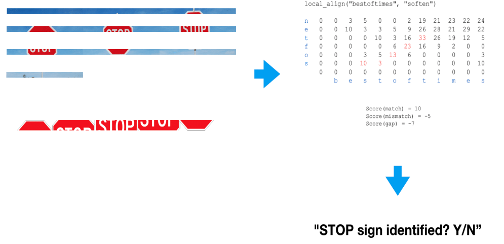
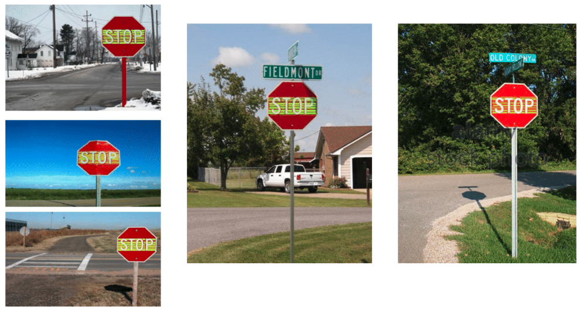
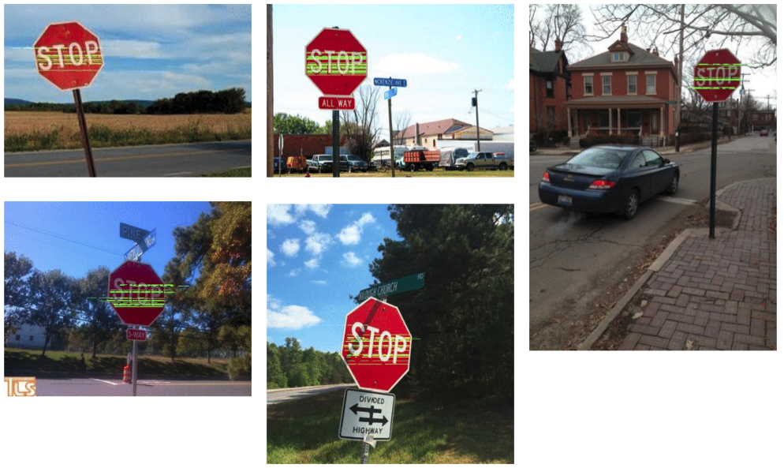

# Local Alighment in STOP sign Detection

In this project, I implemented a object detection system targeting STOP signs on the road. There are various object detection algorithm using machine learning methodology. But I tried to solve the object detection problem using local alignment algorithm that is originally for sequence alignment in *Bioinformatics*

## Objective

In the area of *computer vision*, we have seen significant progress achieving high detection accuracy utilizing high-end technologies in artificial neural network. But when applying this object detection technology into domains that requires instant result in real time such as autonomous driving, the high latency caused by mas-
sive computation become a main issue. With this problem, it become important to introduce new approach that takes less time than existing methodologies. The goal of this project is to show convincing object detection results that is conducted by this approach and to introduce the Local Alignment algorithm as a possible methodology in object detection

## Result
The result of my project is as showing below. The green dots are representing the matched positions identified as 'STOP' signs.

For more information, check the link below

{% include elements/button.html link="https://www.dropbox.com/s/3syihh0bmeucnt0/STOP%20sign%20detection.pdf?dl=0" text="Learn More" %}

