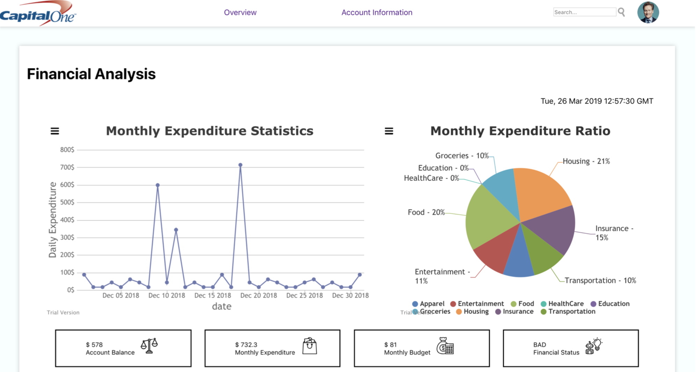

# Money Management Application

The biggest problem that people encounter with their finances is dealing with howand when to spend their money, and what to spend their money on. This isbecause people often do not understand how their spending today affects them inthe future. With reason, we focused on leveraging new technology tocreate helpful tools for the customers.

## Objectives

(1) Build a Machine Learning model to predict an individual’s behavior based on their previousexpenses and provide financial advice (spending / investing) \\
(2) Build a full stack web application that lets customers interact with the money managementservice (UI, API, DB, testing) \\
(3) Learn about Agile practices and delivering results in an effective way 



